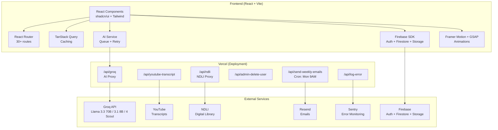

# StudyBuddy AI — Complete Project Brief (A to Z)

> **Name:** StudyBuddy AI (package name: `studybuddy`)
> **Type:** AI-Powered Learning Platform (Single Page Application)
> **Copyright:** © 2026 StudyBuddy AI. All rights reserved.

---

## 1. Languages Used

| Language | Where Used |
|---|---|
| **TypeScript** | Primary language — all frontend components, services, hooks, contexts, API handlers |
| **JavaScript** | Legacy API files ([ndli.js](file:///d:/edunox90-main/api/ndli.js), [_verifyToken.js](file:///d:/edunox90-main/api/_verifyToken.js)), test runners, utility scripts |
| **HTML** | Entry point ([index.html](file:///d:/edunox90-main/index.html)) |
| **CSS** | Global styles ([index.css](file:///d:/edunox90-main/src/index.css)), component CSS (MagicBento.css, TextType.css) |
| **JSON** | Configuration files (package.json, tsconfig, vercel.json, firebase.json, etc.) |
| **Firestore Rules DSL** | Security rules ([firestore.rules](file:///d:/edunox90-main/firestore.rules), [storage.rules](file:///d:/edunox90-main/storage.rules)) |

---

## 2. Frameworks & Build Tools

| Technology | Version | Purpose |
|---|---|---|
| **React** | ^18.3.1 | UI framework (component-based SPA) |
| **Vite** | ^5.4.19 | Build tool & dev server (with SWC for fast compilation) |
| **React Router DOM** | ^6.30.4 | Client-side routing (30+ routes) |
| **TanStack React Query** | ^5.83.0 | Server state management, caching, background sync |
| **TypeScript** | ^5.8.3 | Type safety across the entire codebase |
| **PostCSS** | ^8.5.6 | CSS post-processing |
| **ESLint** | ^9.32.0 | Linting with react-hooks and react-refresh plugins |

---

## 3. Styling & UI Libraries

| Library | Version | Purpose |
|---|---|---|
| **Tailwind CSS** | ^3.4.17 | Utility-first CSS framework (with dark mode via `class` strategy) |
| **tailwindcss-animate** | ^1.0.7 | Pre-built animation utilities |
| **@tailwindcss/typography** | ^0.5.16 | Prose / rich-text styling |
| **shadcn/ui** (Radix-based) | — | Component library (button, card, form, input, label, select, tabs, tooltip, badge, skeleton, sonner, textarea) |
| **Radix UI** | Various | Primitives: `react-label`, `react-select`, `react-slot`, `react-tabs`, `react-tooltip` |
| **Lucide React** | ^0.462.0 | Icon library |
| **class-variance-authority** | ^0.7.1 | Component variant management |
| **clsx** + **tailwind-merge** | — | Conditional class utilities |

### Typography (Google Fonts)
- **Inter** — Primary UI font (weights: 300–800)
- **Sora** — Display/Hero text (weights: 600–800)
- **IBM Plex Serif** — Reading/prose content
- **JetBrains Mono / Fira Code** — Monospace (code blocks)

### Design System Tokens
Custom color system using HSL CSS variables:
- Primary (Azure) `#1D4ED8`, CTA (Amber) `#F97316`, Success `#10B981`, Error `#EF4444`
- Dark mode support, sidebar theming, custom spacing grid (8px-based)

---

## 4. Animation Libraries

| Library | Version | Purpose |
|---|---|---|
| **Framer Motion** | ^12.34.2 | Page transitions, component animations, gesture support |
| **GSAP** | ^3.14.2 | Advanced animations (scroll-triggered, timeline-based) |
| **@gsap/react** | ^2.1.2 | React bindings for GSAP |

Custom animations defined: `fade-up`, `fade-in`, `xp-pop`, `slide-in-right`, `accordion-down/up`

---

## 5. Backend — Firebase (BaaS)

| Service | Usage |
|---|---|
| **Firebase Authentication** | Email/password + Google OAuth sign-in |
| **Cloud Firestore** | NoSQL database — all app data |
| **Firebase Storage** | File uploads (avatars, materials, complaint screenshots) |
| **Firebase Analytics** | Usage tracking (measurement ID configured) |
| **Firebase Performance Monitoring** | Auto page-load/network traces (production-only, lazy-loaded) |
| **Firebase Admin SDK** | ^13.10.0 — Server-side token verification, user management |

### Firestore Collections (21 total)

| Collection | Purpose |
|---|---|
| `users` | Admin-managed user records (source of truth for admin status) |
| `profiles` | Self-writable user profiles (XP, level, display name) |
| `user_preferences` | Learning preferences, theme, daily goals |
| `study_sessions` | Individual study session records (duration, pauses) |
| `xp_logs` | XP awards for activities (study, quiz, lessons, achievements) |
| `user_streaks` | Daily study streaks (current + longest) |
| `lesson_progress` | Per-user lesson completion tracking |
| `topic_progress` | Per-user topic completion tracking |
| `quiz_attempts` | Quiz attempt records |
| `quiz_results` | Quiz results with scores |
| `analytics` | Per-user analytics data |
| `analytics_snapshots` | Daily aggregated analytics for charts |
| `topics` | Official + custom course topics |
| `lessons` | Official + custom lessons |
| `materials` | User-uploaded study materials |
| `flashcards` | User flashcard decks |
| `study_plans` | AI-generated study plans |
| `doubt_sessions` / `doubt_messages` | Doubt Q&A sessions and messages |
| `friends_list` / `follows` | Social relationships (friends + follow system) |
| `notifications` | In-app notifications |
| `feedback` | User feedback submissions |
| `complaints` / `complaint_history` | Complaint system with audit trail |
| `saved_notes` | User-saved notes |
| `parent_guidance` | Parent guidance notes |

### Firestore Security Model
- Role-based access: `isAuthenticated()`, `isUser(uid)`, `isOwner()`, `isAdmin()`
- Admin privilege escalation protection (users cannot self-promote)
- Owner-scoped reads/writes on sensitive collections
- Immutable messages (doubt_messages, follows)

### Storage Rules
- Avatars: max 2 MB, images only, owner-scoped
- Materials: max 20 MB, owner-scoped
- Complaint screenshots: max 5 MB, images only

---

## 6. AI Integration

| Component | Details |
|---|---|
| **AI Provider** | [Groq API](https://api.groq.com/openai/v1/chat/completions) (OpenAI-compatible) |
| **Primary Model** | `llama-3.3-70b-versatile` — chat, doubts, YouTube summaries |
| **Fast Model** | `llama-3.1-8b-instant` — quiz JSON, planner JSON, document analysis |
| **Vision Model** | `meta-llama/llama-4-scout-17b-16e-instruct` — Camera Q&A (image-based) |
| **Proxy** | [/api/groq](file:///d:/edunox90-main/api/groq.ts) — server-side proxy with authentication |

### AI Features
1. **AI Tutor** — Context-aware tutoring with document grounding (max 6,000 chars)
2. **Doubt Solving** — Text + image-based doubt resolution
3. **Camera Q&A** — Snap a photo of a question, get AI solutions (vision model)
4. **YouTube Summarizer** — Transcript extraction + AI-powered summaries with timestamps
5. **Quiz Generation** — AI-generated topic-based assessments (JSON output)
6. **Study Planner** — AI-generated study roadmaps (JSON output)
7. **Document Analysis** — Auto-extract summary + key topics from uploads

### AI Service Architecture ([aiService.ts](file:///d:/edunox90-main/src/lib/aiService.ts))
- **Streaming + Non-streaming** support via SSE
- **Rate limit handling**: Exponential backoff (2s → 4s → 8s), max 3 retries
- **Client-side request queue**: Semaphore limiting 2 concurrent AI requests per tab
- **Prompt templates**: Centralized in [prompts.ts](file:///d:/edunox90-main/src/lib/prompts.ts)

### AI Proxy Security ([groq.ts](file:///d:/edunox90-main/api/groq.ts))
- Firebase Auth token verification required
- Model allowlist (only 3 models permitted)
- Payload caps: max 24 messages, 60K chars, 200KB body (4.4MB for vision)
- Parameter clamping: temperature 0–1, max_tokens 1–4096
- 55s upstream timeout

---

## 7. Serverless API Endpoints (Vercel Functions)

| Endpoint | File | Purpose |
|---|---|---|
| `/api/groq` | [groq.ts](file:///d:/edunox90-main/api/groq.ts) | AI proxy to Groq API |
| `/api/youtube-transcript` | [youtube-transcript.ts](file:///d:/edunox90-main/api/youtube-transcript.ts) | YouTube transcript extraction |
| `/api/ndli` | [ndli.js](file:///d:/edunox90-main/api/ndli.js) | National Digital Library of India proxy |
| `/api/admin-delete-user` | [admin-delete-user.ts](file:///d:/edunox90-main/api/admin-delete-user.ts) | Admin user deletion |
| `/api/send-weekly-emails` | [send-weekly-emails.ts](file:///d:/edunox90-main/api/send-weekly-emails.ts) | Weekly email reports (cron: Mondays 9 AM) |
| `/api/log-error` | [log-error.ts](file:///d:/edunox90-main/api/log-error.ts) | Client error logging |

### Auth Middleware
[_verifyToken.js](file:///d:/edunox90-main/api/_verifyToken.js) — Firebase Admin SDK token verification using `jose` library

---

## 8. Third-Party Services & APIs

| Service | Purpose | Config |
|---|---|---|
| **Groq** | LLM inference (Llama models) | `GROQ_API_KEY` |
| **Firebase** | Auth, DB, Storage, Analytics, Performance | `VITE_FIREBASE_*` env vars |
| **Vercel** | Hosting + Serverless functions + Cron jobs | [vercel.json](file:///d:/edunox90-main/vercel.json) |
| **Resend** | Transactional email delivery | `RESEND_API_KEY` |
| **Sentry** | Error monitoring (optional, lazy-loaded) | `VITE_SENTRY_DSN` |
| **YouTube Transcript API** | Video transcript extraction | `YOUTUBE_API_KEY` (Supbase.ai) |
| **NDLI** | National Digital Library of India search | Proxied through `/api/ndli` |
| **Google Fonts** | Typography (Inter, Sora, IBM Plex Serif) | CDN loaded |

---

## 9. Application Features & Pages

### Authentication & Onboarding
- [Login.tsx](file:///d:/edunox90-main/src/pages/auth/Login.tsx) — Email/password + Google OAuth
- [Signup.tsx](file:///d:/edunox90-main/src/pages/auth/Signup.tsx) — User registration
- [OnboardingFlow.tsx](file:///d:/edunox90-main/src/pages/onboarding/OnboardingFlow.tsx) — Multi-stage new user onboarding

### Core Learning
- [Dashboard.tsx](file:///d:/edunox90-main/src/pages/Dashboard.tsx) — Main dashboard with stats and quick actions
- [LessonList.tsx](file:///d:/edunox90-main/src/pages/lessons/LessonList.tsx) — Browse curated learning paths
- [LessonViewer.tsx](file:///d:/edunox90-main/src/pages/lessons/LessonViewer.tsx) — Lesson viewer with embedded YouTube + side tools
- [AITutor.tsx](file:///d:/edunox90-main/src/pages/materials/AITutor.tsx) — AI chat tutor (general + document-grounded)
- [AILearning.tsx](file:///d:/edunox90-main/src/pages/materials/AILearning.tsx) — AI-powered learning sessions
- [MaterialUpload.tsx](file:///d:/edunox90-main/src/pages/materials/MaterialUpload.tsx) — Upload & manage study materials (56 KB — largest page)

### Doubt Solving
- [DoubtInput.tsx](file:///d:/edunox90-main/src/pages/doubts/DoubtInput.tsx) — Submit text/image doubts
- [AISolution.tsx](file:///d:/edunox90-main/src/pages/doubts/AISolution.tsx) — AI-generated solutions
- [CameraQnA.tsx](file:///d:/edunox90-main/src/pages/doubts/CameraQnA.tsx) — Camera-based Q&A (vision model)
- [DoubtHistory.tsx](file:///d:/edunox90-main/src/pages/doubts/DoubtHistory.tsx) — Past doubt sessions
- [DoubtSession.tsx](file:///d:/edunox90-main/src/pages/doubts/DoubtSession.tsx) — Individual doubt thread

### Assessment & Practice
- [TopicSelection.tsx](file:///d:/edunox90-main/src/pages/quiz/TopicSelection.tsx) — Choose quiz topics
- [QuizPage.tsx](file:///d:/edunox90-main/src/pages/quiz/QuizPage.tsx) — Interactive quiz engine
- [QuizResults.tsx](file:///d:/edunox90-main/src/pages/quiz/QuizResults.tsx) — Quiz results and review
- [Flashcards.tsx](file:///d:/edunox90-main/src/pages/materials/Flashcards.tsx) — Flashcard study tool

### Tools & Utilities
- [QuickTools.tsx](file:///d:/edunox90-main/src/pages/tools/QuickTools.tsx) — Notes, Calculator, AI Summarizer
- [YoutubeSummarizer.tsx](file:///d:/edunox90-main/src/pages/tools/YoutubeSummarizer.tsx) — YouTube video summarization workspace (47 KB)
- [ConceptExplorerWorkspace.tsx](file:///d:/edunox90-main/src/pages/tools/ConceptExplorerWorkspace.tsx) — Concept exploration
- [StudyPlanner.tsx](file:///d:/edunox90-main/src/pages/materials/StudyPlanner.tsx) — AI-generated study roadmaps
- [TimerPage.tsx](file:///d:/edunox90-main/src/pages/timer/TimerPage.tsx) — Study timer with Pomodoro-style tracking

### Analytics & Progress
- [ProgressDashboard.tsx](file:///d:/edunox90-main/src/pages/progress/ProgressDashboard.tsx) — Daily/weekly/monthly analytics (47 KB — uses Recharts)
- **Recharts** ^2.15.4 for data visualization

### Social & Gamification
- [Leaderboard.tsx](file:///d:/edunox90-main/src/pages/social/Leaderboard.tsx) — XP leaderboards with follow system (35 KB)
- [Friends.tsx](file:///d:/edunox90-main/src/pages/social/Friends.tsx) — Friend requests and management
- [Achievements.tsx](file:///d:/edunox90-main/src/pages/social/Achievements.tsx) — Achievement badges and milestones
- XP system, daily streaks, levels

### Admin
- [AdminLogin.tsx](file:///d:/edunox90-main/src/pages/admin/AdminLogin.tsx) — Admin authentication
- [AdminPanel.tsx](file:///d:/edunox90-main/src/pages/admin/AdminPanel.tsx) — Full admin dashboard (71 KB — largest file)

### Settings & Profile
- [Profile.tsx](file:///d:/edunox90-main/src/pages/Profile.tsx) — User profile management
- [Settings.tsx](file:///d:/edunox90-main/src/pages/Settings.tsx) — App settings (34 KB)
- [Feedback.tsx](file:///d:/edunox90-main/src/pages/Feedback.tsx) — User feedback submission
- [About.tsx](file:///d:/edunox90-main/src/pages/About.tsx) — About page

---

## 10. Shared Components

### Layout
- [AppLayout.tsx](file:///d:/edunox90-main/src/components/layout/AppLayout.tsx) — Main app shell with sidebar navigation

### Functional Components
- [StudyBuddyAIChat.tsx](file:///d:/edunox90-main/src/components/StudyBuddyAIChat.tsx) — Floating AI chat widget
- [GlobalTimer.tsx](file:///d:/edunox90-main/src/components/GlobalTimer.tsx) — Persistent study timer (27 KB)
- [ProtectedRoute.tsx](file:///d:/edunox90-main/src/components/ProtectedRoute.tsx) — Auth guard
- [AdminRoute.tsx](file:///d:/edunox90-main/src/components/AdminRoute.tsx) — Admin auth guard
- [ErrorBoundary.tsx](file:///d:/edunox90-main/src/components/ErrorBoundary.tsx) — React error boundary
- [FeedbackEnforcer.tsx](file:///d:/edunox90-main/src/components/FeedbackEnforcer.tsx) — Feedback collection enforcer
- [NotificationPanel.tsx](file:///d:/edunox90-main/src/components/NotificationPanel.tsx) — In-app notifications
- [RetentionTrajectory.tsx](file:///d:/edunox90-main/src/components/RetentionTrajectory.tsx) — Retention analytics widget
- [SnapEnhance.tsx](file:///d:/edunox90-main/src/components/SnapEnhance.tsx) — Image capture enhancement

### Landing Page Components (10 sections)
`HeroSection`, `FeaturesGrid`, `AITutorSection`, `GamificationSection`, `ProgressSection`, `StudyLoop`, `Testimonials`, `FinalCTA`, `Navbar`, `Footer`

### UI Library (shadcn/ui — 20 components)
`button`, `card`, `form`, `input`, `label`, `select`, `tabs`, `tooltip`, `badge`, `skeleton`, `sonner` (toasts), `textarea`, `background-paths`, `tubelight-navbar`, `DecryptedText`, `MagicBento`, `SplitText`, `TextType`

### Motion Components
- [FadeIn.tsx](file:///d:/edunox90-main/src/components/motion/FadeIn.tsx) — Scroll-triggered fade animation
- [PageTransition.tsx](file:///d:/edunox90-main/src/components/motion/PageTransition.tsx) — Route transition wrapper

---

## 11. React Contexts & Hooks

### Contexts
| Context | Purpose |
|---|---|
| [AuthContext.tsx](file:///d:/edunox90-main/src/contexts/AuthContext.tsx) | Firebase auth state, login/logout, current user |
| [NotificationContext.tsx](file:///d:/edunox90-main/src/contexts/NotificationContext.tsx) | In-app notification management |

### Custom Hooks
| Hook | Purpose |
|---|---|
| [useDashboardData.ts](file:///d:/edunox90-main/src/hooks/useDashboardData.ts) | Dashboard data fetching/caching (16 KB) |
| [useDeepFocus.tsx](file:///d:/edunox90-main/src/hooks/useDeepFocus.tsx) | Deep Focus Mode — minimal UI for distraction-free study |
| [useDraggable.ts](file:///d:/edunox90-main/src/hooks/useDraggable.ts) | Drag interaction for floating widgets |

---

## 12. Service Layer ([src/lib/](file:///d:/edunox90-main/src/lib))

| File | Purpose |
|---|---|
| [aiService.ts](file:///d:/edunox90-main/src/lib/aiService.ts) | AI completion (streaming + non-streaming) with retry, queue, abort |
| [analytics.ts](file:///d:/edunox90-main/src/lib/analytics.ts) | Study analytics, productivity scoring, consistency metrics |
| [authHeaders.ts](file:///d:/edunox90-main/src/lib/authHeaders.ts) | Firebase auth token extraction for API calls |
| [ensureGoogleProfile.ts](file:///d:/edunox90-main/src/lib/ensureGoogleProfile.ts) | Google sign-in profile provisioning |
| [errorMonitor.ts](file:///d:/edunox90-main/src/lib/errorMonitor.ts) | Client-side error reporting to `/api/log-error` |
| [firebase.ts](file:///d:/edunox90-main/src/lib/firebase.ts) | Firebase app initialization (Auth, Firestore, Storage, Performance) |
| [firebaseAuthErrors.ts](file:///d:/edunox90-main/src/lib/firebaseAuthErrors.ts) | User-friendly auth error messages |
| [friends.ts](file:///d:/edunox90-main/src/lib/friends.ts) | Friend request/accept/decline logic |
| [imageUtils.ts](file:///d:/edunox90-main/src/lib/imageUtils.ts) | Image compression and processing |
| [prompts.ts](file:///d:/edunox90-main/src/lib/prompts.ts) | Centralized AI prompt templates |
| [sentry.ts](file:///d:/edunox90-main/src/lib/sentry.ts) | Sentry error tracking (optional, lazy-loaded) |
| [studySession.ts](file:///d:/edunox90-main/src/lib/studySession.ts) | Study session start/stop/pause management |
| [userFacingErrors.ts](file:///d:/edunox90-main/src/lib/userFacingErrors.ts) | AI error → user-friendly message mapping |
| [userStats.ts](file:///d:/edunox90-main/src/lib/userStats.ts) | User statistics computation |
| [utils.ts](file:///d:/edunox90-main/src/lib/utils.ts) | General utilities (class merging, date helpers) |
| [xp.ts](file:///d:/edunox90-main/src/lib/xp.ts) | XP award logic and level calculations |
| [youtube.ts](file:///d:/edunox90-main/src/lib/youtube.ts) | YouTube URL parsing utilities |

---

## 13. Additional Libraries

| Library | Version | Purpose |
|---|---|---|
| **react-markdown** | ^10.1.0 | Render AI-generated Markdown responses |
| **pdfjs-dist** | ^4.4.168 | PDF document rendering (study materials) |
| **react-hook-form** | ^7.61.1 | Form state management |
| **@hookform/resolvers** | ^3.10.0 | Form validation resolvers |
| **zod** | ^3.25.76 | Schema validation (forms, API payloads) |
| **jose** | ^6.2.3 | JWT verification (server-side token validation) |
| **sonner** | ^1.7.4 | Toast notifications |
| **next-themes** | ^0.3.0 | Dark/light theme toggling |
| **resend** | ^6.12.4 | Email sending SDK |
| **youtube-transcript** | ^1.3.1 | YouTube transcript fetching |
| **recharts** | ^2.15.4 | Data visualization charts |
| **@sentry/react** | ^8.55.2 | Error monitoring (optional) |

---

## 14. Performance & Optimization

- **Route-level code splitting**: `React.lazy()` + `Suspense` for all authenticated routes (~45% initial bundle reduction)
- **Manual vendor chunking** (Vite rollup):
  - `vendor-react` — React, ReactDOM, React Router
  - `vendor-firebase` — All Firebase modules
  - `vendor-recharts` — Charting library
  - `vendor-radix` — Radix UI primitives
  - `vendor-animation` — Framer Motion + GSAP
  - `vendor-markdown` — React Markdown
  - `vendor-pdf` — PDF.js
- **Chunk size warning limit**: 600 KB
- **Source maps**: Enabled in production
- **React Query caching**: 5-min stale time, 30-min GC, no refetch on window focus
- **Firebase Performance**: Auto page-load + network traces (production only)
- **AI concurrency limiter**: Max 2 concurrent requests per browser tab

---

## 15. Deployment & Infrastructure

| Aspect | Detail |
|---|---|
| **Hosting** | Vercel |
| **Framework** | Vite (configured in [vercel.json](file:///d:/edunox90-main/vercel.json)) |
| **Build command** | `npm run build` |
| **Output directory** | `dist/` |
| **Serverless functions** | `api/*.ts` and `api/*.js` (max 60s duration) |
| **Cron jobs** | Weekly emails: `0 9 * * 1` (Mondays 9 AM) → `/api/send-weekly-emails` |
| **SPA routing** | Catch-all rewrite `/((?!api/).*)` → `/index.html` |
| **Node version** | ≥20 <25 |
| **Dev server** | Port 5000, host `0.0.0.0`, HMR overlay disabled |
| **Vercel API emulation** | Custom Vite plugin mimics Vercel serverless locally |

---

## 16. Testing

| Type | Tool | Files |
|---|---|---|
| **QA Tests** | Custom test runner | [run-qa.mjs](file:///d:/edunox90-main/tests/run-qa.mjs) (`npm run qa`) |
| **Load Tests** | k6 | [run-load.mjs](file:///d:/edunox90-main/tests/run-load.mjs) (frontend + API modes) |
| **Report Generation** | Python script | [make_report_pdf.py](file:///d:/edunox90-main/tests/make_report_pdf.py) |

---

## 17. SEO & Meta Tags

- Open Graph tags (title, description, type, image)
- Twitter Card meta (summary_large_image)
- Descriptive `<title>` and `<meta description>`
- Favicon configured
- Google Fonts preconnected

---

## 18. Project Statistics

| Metric | Value |
|---|---|
| **Total source files** | ~80+ TypeScript/JavaScript files |
| **Largest file** | AdminPanel.tsx (71 KB) |
| **Total pages** | 30+ routes |
| **UI components** | 20+ reusable components |
| **Firestore collections** | 21 collections |
| **API endpoints** | 6 serverless functions |
| **npm dependencies** | 31 (production) + 16 (dev) |
| **AI models** | 3 (large, small, vision) |

---

## 19. Environment Variables Summary

| Variable | Scope | Purpose |
|---|---|---|
| `VITE_FIREBASE_API_KEY` | Client | Firebase config |
| `VITE_FIREBASE_AUTH_DOMAIN` | Client | Firebase config |
| `VITE_FIREBASE_PROJECT_ID` | Client | Firebase config |
| `VITE_FIREBASE_STORAGE_BUCKET` | Client | Firebase config |
| `VITE_FIREBASE_MESSAGING_SENDER_ID` | Client | Firebase config |
| `VITE_FIREBASE_APP_ID` | Client | Firebase config |
| `VITE_FIREBASE_MEASUREMENT_ID` | Client | Firebase Analytics |
| `GROQ_API_KEY` | Server | Groq AI API key |
| `YOUTUBE_API_KEY` | Server | YouTube transcript extraction |
| `FIREBASE_SERVICE_ACCOUNT_KEY` | Server | Firebase Admin SDK |
| `RESEND_API_KEY` | Server | Email delivery |
| `VITE_SENTRY_DSN` | Client (optional) | Sentry error tracking |
| `VITE_SENTRY_TRACES_SAMPLE_RATE` | Client (optional) | Sentry trace sampling |

---

## 20. Architecture Diagram

